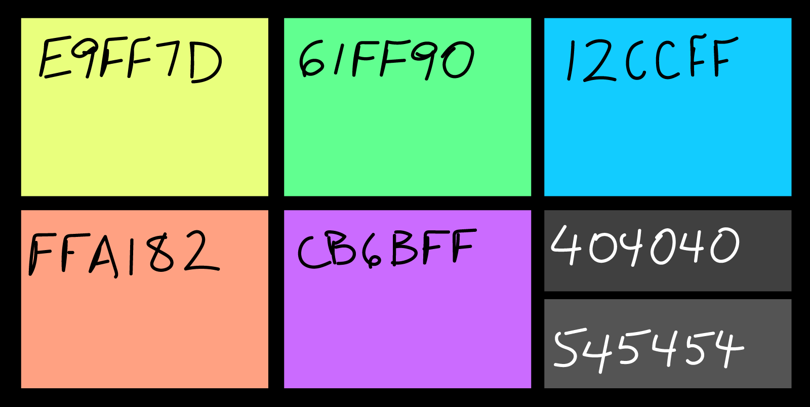
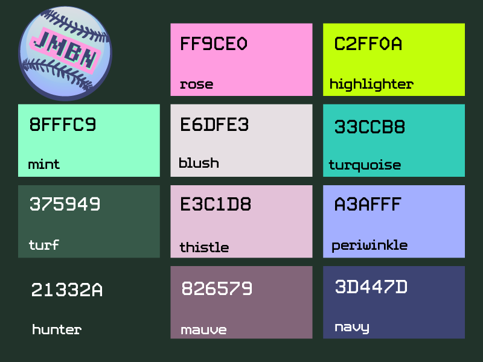
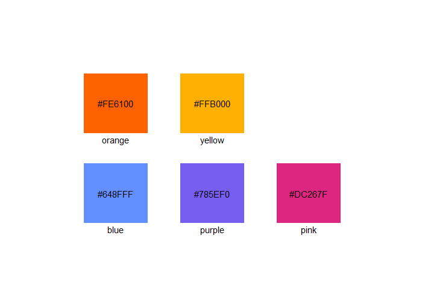
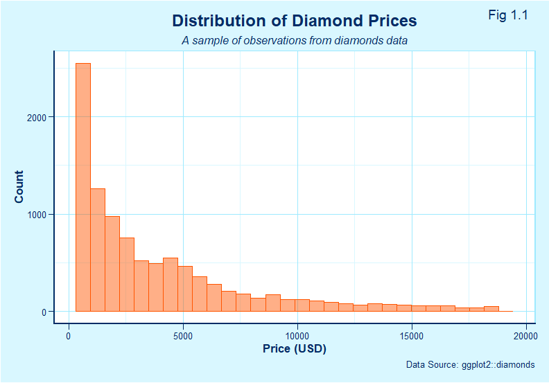
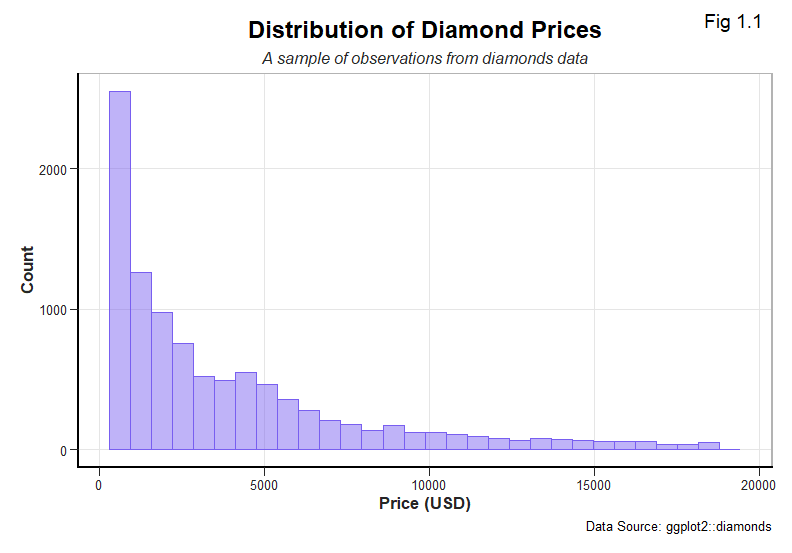
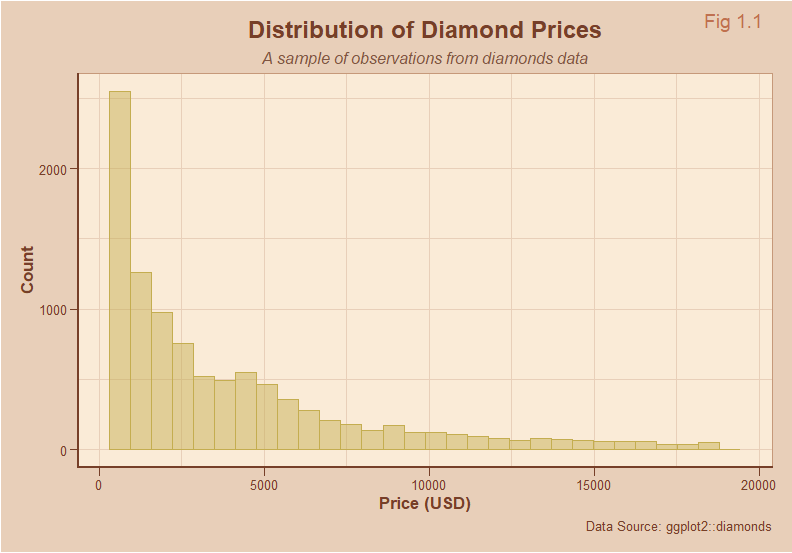
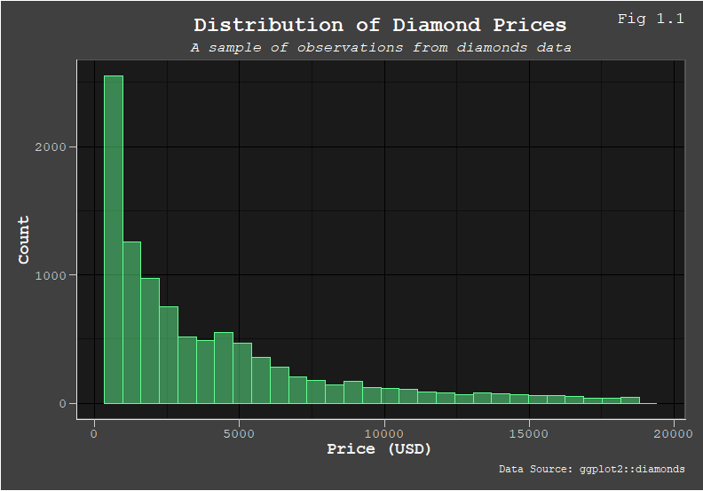
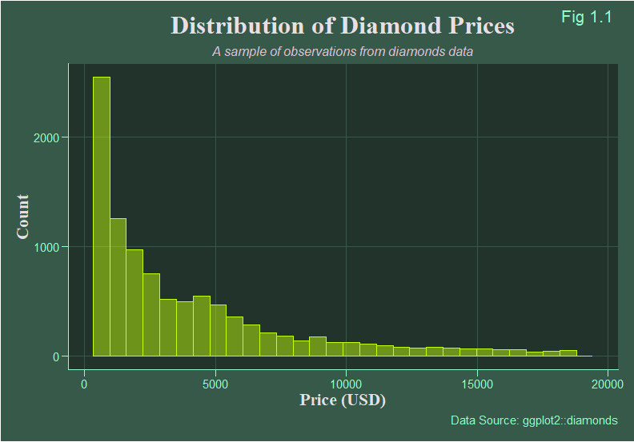

# datavizExtras
Colors, Themes and Functions to use with ggplot2 for R.

## [colorConstants.R](colorConstants.R)

**oj** - a named vector of 14 colors: orange0, orange1, orange2, orange3, orange4, orange5, orangeK, blue0, blue1, blue2, blue3, blue4, blue5, blueK.

**blkboard** - a named vector of 7 colors: orange, yellow, green, blue, purple, greyDK, greyLT.

**jmbn** - a named vector of 11 colors: hunter, turf, mint, turquoise, highlighter, rose, blush, thistle, mauve, periwinkle, navy.

**redrock** - a named vector of 12 colors: mud, cocoa, stone, sand, cinnamon, terracotta, moss, cactus, yucca, cloud, sky, night.

**ibm** - a named vector of 5 colors: blue, purple, pink, orange, yellow.

## [extraThemes.R](extraThemes.R)

**juiceGlass** - a ggplot2 theme; a clean, light blue theme that goes well with orange.

**napkin** - a ggplot2 theme; a mostly white minimalist theme.

**sandstone** - a ggplot2 theme; a theme for the redrock color scheme.

**dustyBlk** - a ggplot2 theme; a theme for the blkboard color scheme.

**digiturf** - a ggplot2 theme; a theme for the jmbn color scheme.

## [datavizExtras.R](datavizExtras.R)

**hex(hexCode)** - a function that takes a six-digit hex code and returns an rgb color object.

**transpa(colorObject, alpha1to255)** - a function that takes an rgb color object and an integer between 1 (0% opacity) and 255 (100% opacity), and returns a transparent version of the same color.  

**see_colors(aColorVector, buffer = 1, numCols = 3)** - a function that takes a vector of colors, named or unnamed, and produces a plot showing the colors and their hex values.

**plot_colors(aColorVector, buffer = 1, numCols = 3)** - a function that takes a vector of colors, named or unnamed, and returns a ggplot object showing the colors and their hex values.

